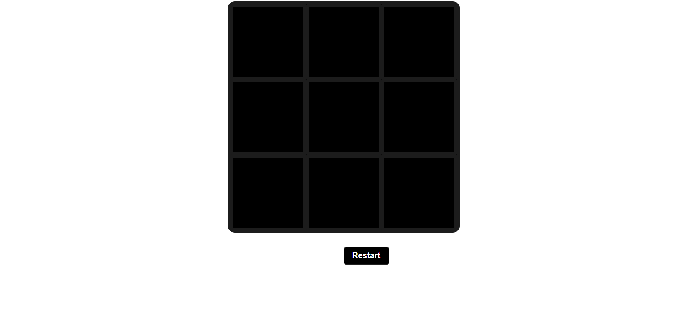
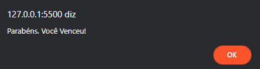
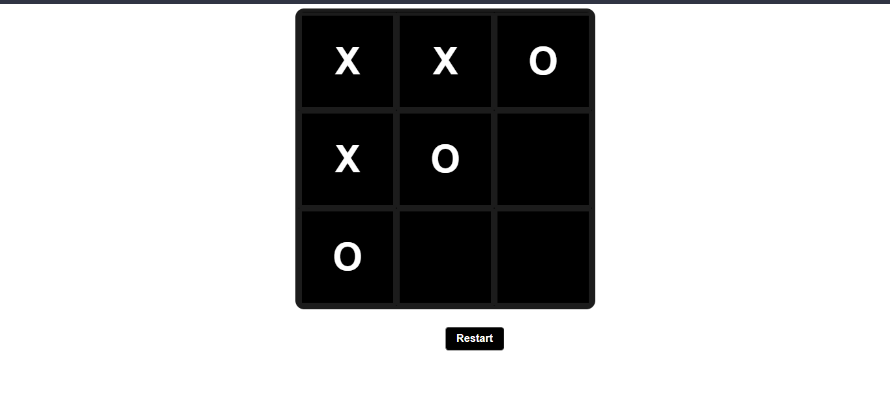

<h1 align="center"> Tic Tac Toe </h1>

<h2> About 📖 </h2>
<h3> This is a mini game created with the intention of relaxing the mind. </h3>
<h3> This is a project developed in JavaScript ES6+. </h3>

--

<h2> Screenshots 📸 </h2>

  Alert issued on screen when player wins the game! 

 Play representation. 

